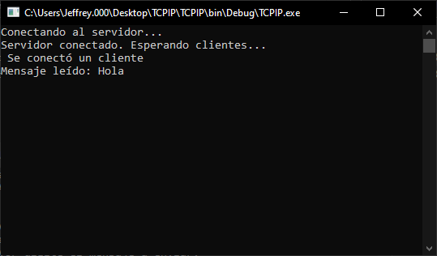
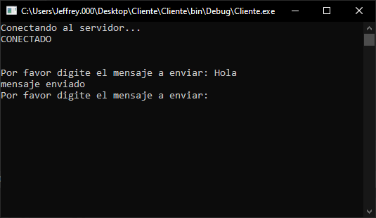

# Programa sencillo que envía mensajes desde un cliente hasta un servidor via TCP/IP

## Contenido
* Directorio con el programa del servidor.
* Directorio con el programa del cliente.

## Cracterísticas
Programa de consola de comandos

## Capturas

### Servidor

### Cliente
